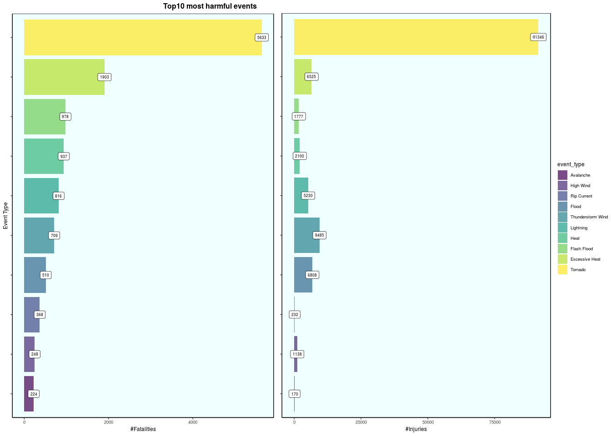
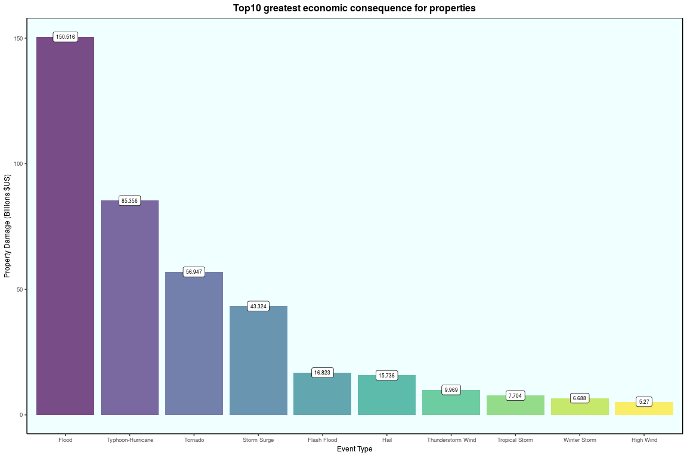
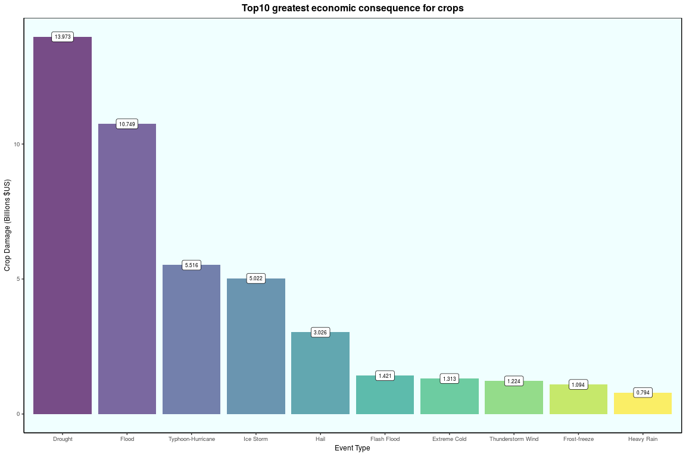

# Synopsis
The aim of this report is to use exploratory analysis on the NOAA Storm Database (from U.S. National Oceanic and Atmospheric Administration, 
https://www.ncdc.noaa.gov/) for the years between  *1950-2011*, in order to provide answers to two main questions:

- which types of meteorological events, in the US are the most harmful for the population health and  
- which types of events, in the US have the greatest economic consequences  

The Dataset we worked on is located at https://d396qusza40orc.cloudfront.net/repdata/data/StormData.csv.bz2

We found that the most lethal meteorologival event was the tornado which is also number one in the number of injuries. 
Our analysis provides a summary of the 10 most harmful events.
Regarding the econmic impact of meteorological event, we found that flood is number one for properties while drought is the top one for agricutural crops.
Here as well we provide details for 10 greatest economic consequences.

# Data Processing

## Loading the data


```r
library(dplyr)

cfile <- "StormData.csv.bz2"
url <- paste("https://d396qusza40orc.cloudfront.net/repdata/data/", cfile, sep="")

(!file.exists(cfile)) && { download.file(url, destfile=cfile, method="curl", quiet=TRUE) }
```

```
## [1] FALSE
```

```r
df <- tibble::as.tibble(read.csv(cfile, header=TRUE, na.strings="NA", stringsAsFactors=FALSE))

dim(df)
```

```
## [1] 902297     37
```

```r
head(df, 5)
```

<div data-pagedtable="false">
  <script data-pagedtable-source type="application/json">
{"columns":[{"label":["STATE__"],"name":[1],"type":["dbl"],"align":["right"]},{"label":["BGN_DATE"],"name":[2],"type":["chr"],"align":["left"]},{"label":["BGN_TIME"],"name":[3],"type":["chr"],"align":["left"]},{"label":["TIME_ZONE"],"name":[4],"type":["chr"],"align":["left"]},{"label":["COUNTY"],"name":[5],"type":["dbl"],"align":["right"]},{"label":["COUNTYNAME"],"name":[6],"type":["chr"],"align":["left"]},{"label":["STATE"],"name":[7],"type":["chr"],"align":["left"]},{"label":["EVTYPE"],"name":[8],"type":["chr"],"align":["left"]},{"label":["BGN_RANGE"],"name":[9],"type":["dbl"],"align":["right"]},{"label":["BGN_AZI"],"name":[10],"type":["chr"],"align":["left"]},{"label":["BGN_LOCATI"],"name":[11],"type":["chr"],"align":["left"]},{"label":["END_DATE"],"name":[12],"type":["chr"],"align":["left"]},{"label":["END_TIME"],"name":[13],"type":["chr"],"align":["left"]},{"label":["COUNTY_END"],"name":[14],"type":["dbl"],"align":["right"]},{"label":["COUNTYENDN"],"name":[15],"type":["lgl"],"align":["right"]},{"label":["END_RANGE"],"name":[16],"type":["dbl"],"align":["right"]},{"label":["END_AZI"],"name":[17],"type":["chr"],"align":["left"]},{"label":["END_LOCATI"],"name":[18],"type":["chr"],"align":["left"]},{"label":["LENGTH"],"name":[19],"type":["dbl"],"align":["right"]},{"label":["WIDTH"],"name":[20],"type":["dbl"],"align":["right"]},{"label":["F"],"name":[21],"type":["int"],"align":["right"]},{"label":["MAG"],"name":[22],"type":["dbl"],"align":["right"]},{"label":["FATALITIES"],"name":[23],"type":["dbl"],"align":["right"]},{"label":["INJURIES"],"name":[24],"type":["dbl"],"align":["right"]},{"label":["PROPDMG"],"name":[25],"type":["dbl"],"align":["right"]},{"label":["PROPDMGEXP"],"name":[26],"type":["chr"],"align":["left"]},{"label":["CROPDMG"],"name":[27],"type":["dbl"],"align":["right"]},{"label":["CROPDMGEXP"],"name":[28],"type":["chr"],"align":["left"]},{"label":["WFO"],"name":[29],"type":["chr"],"align":["left"]},{"label":["STATEOFFIC"],"name":[30],"type":["chr"],"align":["left"]},{"label":["ZONENAMES"],"name":[31],"type":["chr"],"align":["left"]},{"label":["LATITUDE"],"name":[32],"type":["dbl"],"align":["right"]},{"label":["LONGITUDE"],"name":[33],"type":["dbl"],"align":["right"]},{"label":["LATITUDE_E"],"name":[34],"type":["dbl"],"align":["right"]},{"label":["LONGITUDE_"],"name":[35],"type":["dbl"],"align":["right"]},{"label":["REMARKS"],"name":[36],"type":["chr"],"align":["left"]},{"label":["REFNUM"],"name":[37],"type":["dbl"],"align":["right"]}],"data":[{"1":"1","2":"4/18/1950 0:00:00","3":"0130","4":"CST","5":"97","6":"MOBILE","7":"AL","8":"TORNADO","9":"0","10":"","11":"","12":"","13":"","14":"0","15":"NA","16":"0","17":"","18":"","19":"14.0","20":"100","21":"3","22":"0","23":"0","24":"15","25":"25.0","26":"K","27":"0","28":"","29":"","30":"","31":"","32":"3040","33":"8812","34":"3051","35":"8806","36":"","37":"1"},{"1":"1","2":"4/18/1950 0:00:00","3":"0145","4":"CST","5":"3","6":"BALDWIN","7":"AL","8":"TORNADO","9":"0","10":"","11":"","12":"","13":"","14":"0","15":"NA","16":"0","17":"","18":"","19":"2.0","20":"150","21":"2","22":"0","23":"0","24":"0","25":"2.5","26":"K","27":"0","28":"","29":"","30":"","31":"","32":"3042","33":"8755","34":"0","35":"0","36":"","37":"2"},{"1":"1","2":"2/20/1951 0:00:00","3":"1600","4":"CST","5":"57","6":"FAYETTE","7":"AL","8":"TORNADO","9":"0","10":"","11":"","12":"","13":"","14":"0","15":"NA","16":"0","17":"","18":"","19":"0.1","20":"123","21":"2","22":"0","23":"0","24":"2","25":"25.0","26":"K","27":"0","28":"","29":"","30":"","31":"","32":"3340","33":"8742","34":"0","35":"0","36":"","37":"3"},{"1":"1","2":"6/8/1951 0:00:00","3":"0900","4":"CST","5":"89","6":"MADISON","7":"AL","8":"TORNADO","9":"0","10":"","11":"","12":"","13":"","14":"0","15":"NA","16":"0","17":"","18":"","19":"0.0","20":"100","21":"2","22":"0","23":"0","24":"2","25":"2.5","26":"K","27":"0","28":"","29":"","30":"","31":"","32":"3458","33":"8626","34":"0","35":"0","36":"","37":"4"},{"1":"1","2":"11/15/1951 0:00:00","3":"1500","4":"CST","5":"43","6":"CULLMAN","7":"AL","8":"TORNADO","9":"0","10":"","11":"","12":"","13":"","14":"0","15":"NA","16":"0","17":"","18":"","19":"0.0","20":"150","21":"2","22":"0","23":"0","24":"2","25":"2.5","26":"K","27":"0","28":"","29":"","30":"","31":"","32":"3412","33":"8642","34":"0","35":"0","36":"","37":"5"}],"options":{"columns":{"min":{},"max":[10]},"rows":{"min":[10],"max":[10]},"pages":{}}}
  </script>
</div>

## Tidy up

Looking at the dataset and the *Storm Data Event Table*, `pd01016005curr.pdf`, section 2.1.1, it looks like some values in 
the event type column are spelled differently (sometimes, even the case is different) but identical in meaning and should be put together.

Anticipating on the required columns to address the two main questions, I will only work on a subset of the original dataset, namely the following columns:

- `EVTYPE`, `FATALITIES`, `INJURIES`, `PROPDMG`, `PROPDMGEXP`, `CROPDMG`, `CROPDMGEXP`


```r
df <- subset(df, select=c("EVTYPE", "FATALITIES", "INJURIES", "PROPDMG", "PROPDMGEXP", "CROPDMG", "CROPDMGEXP"))
```

Before applying transformations on the column `EVTYPE`, we can see that we have 985 different event types:

```r
length(unique(df$EVTYPE)) 
```

```
## [1] 985
```

For example, the values beginning with `FLOOD` are the following (notice the *spelling*, *case*, *plural/singular*, *repetition*... Typical of how, we human interprets, reports things slightly differenlty):

```r
unique(df[grep("^FLOOD", df$EVTYPE, ignore.case=TRUE, perl=TRUE),]$EVTYPE)
```

```
##  [1] "FLOODING"             "FLOOD"                "FLOOD WATCH/"        
##  [4] "FLOODING/HEAVY RAIN"  "FLOOD/FLASH FLOOD"    "FLOOD/RAIN/WINDS"    
##  [7] "FLOOD/RAIN/WIND"      "FLOODS"               "FLOOD/RIVER FLOOD"   
## [10] "FLOOD/FLASH FLOODING" "FLOOD FLASH"          "FLOOD FLOOD/FLASH"   
## [13] "FLOOD/FLASH"          "FLOOD & HEAVY RAIN"   "FLOOD/FLASHFLOOD"    
## [16] "Flood/Flash Flood"    "Flood"                "Flood/Strong Wind"   
## [19] "FLOOD/FLASH/FLOOD"
```

The following functions work on the `EVTYPE` column of our dataset, trying to clean up that column.   
Several pipelines are defined on `EVTYPE` to:

- remove all extra spaces (whether at the edges or betwwen words),
- replace `/` with `-`,
- remove some special characters (double back-quote, ampersand...)
- capitalize the words,
- suppress pluralization,
- replace abbreviation (when known),
- swap order,
- trying to consolidate synonym expressions


```r
library(stringr)

capitalize <- function(str) {
  s <- strsplit(str, " ")[[1]]
  paste(toupper(substring(s, 1, 1)), tolower(substring(s, 2)), sep="", collapse=" ")
}

# character replacement
s_normalize <- function(v) {
  v %>%
    str_trim() %>%
    str_replace("AND|&", "/") %>%
    str_replace("\\\\", "/") %>% 
    str_replace_all("/", " / ") %>%
    str_replace_all(" / | /|/ ", "-") %>%
    sapply(capitalize, simplify=TRUE)
}

# applying regexp to replace some values
s_replace <- function(d_f, colname, pattern, repl, icase=TRUE, p=TRUE) { 
  ixs <- grep(pattern, d_f[[colname]], ignore.case=icase, perl=p)
  if (length(ixs) != 0) {
    d_f[ixs,][[colname]] = repl
  }
  d_f
} 

# define a sequence of changes - this can be extended....
wr_replace <- function(d_f) {
  d_f %>%
    s_replace("EVTYPE", "[ ]+/$", "") %>%
    s_replace("EVTYPE", "^River Flood", "Flood") %>%  # 2.1.1 refer only to Flood
    s_replace("EVTYPE", "Flooding|Floods", "Flood") %>%
    s_replace("EVTYPE", "Flood Flood", "Flood") %>%
    s_replace("EVTYPE", "Flood.Flash.*$", "Flash-Flood") %>%
    s_replace("EVTYPE", "Flood-Rain/wind.?", "Flood-Rain-Wind") %>%
    s_replace("EVTYPE", "^Heavy Rains$", "Heavy Rain") %>%
    s_replace("EVTYPE", "^Tstm Win|^Thunderstorm Win|^Thunderstormw", "Thunderstorm Wind") %>%
    s_replace("EVTYPE", "Typhoon|Hurricane", "Typhoon-Hurricane") %>%
    s_replace("EVTYPE", "^Hail.?(?:\\d+|\\d+\\.\\d+)\\)?$", "Hail") %>%
    s_replace("EVTYPE", "^High Winds? \\d+$", "High Wind")
}

# call previous defnied functions
combine <- function(df) {
  df$EVTYPE <- s_normalize(df$EVTYPE)
  wr_replace(df)
}

ndf <- combine(df)
```

Now the column `EVTYPE`, has 726 consolidated event types:

```r
length(unique(ndf$EVTYPE)) 
```

```
## [1] 726
```

For example, the values begining with `FLOOD` are the following:

```r
unique(ndf[grep("^Flood", ndf$EVTYPE, perl=TRUE),]$EVTYPE)
```

```
## [1] "Flood"              "Flood Watch-"       "Flood-rain-winds"  
## [4] "Flood-rain-wind"    "Flood-river Flood"  "Flood - Heavy Rain"
## [7] "Flood-strong Wind"
```

**Note**: Some more work can be done on the remaining values on the `EVTYPE` column, however this does not have impact on the top `n` results (`n` being 10) of my answers to the two main questions.  


## Most harmful meteorological events for the population health
According to datasset (*Storm Data Event Table*, `pd01016005curr.pdf`, section 2.1.1) the relevant fields (columns) to address this question are the following:

- EVTYPE which we will rename as event_type,
- FATALITIES,
- INJURIES.

No missing values, as we can see from:

```r
sapply(subset(df, select=c('EVTYPE', 'FATALITIES', 'INJURIES')), function(x) {sum(is.na(x))})
```

```
##     EVTYPE FATALITIES   INJURIES 
##          0          0          0
```
In the following my interpretation is to consider **fatalities**, then **injuries** *in this order* to determine the most harmful events.

To summarize the data we use a pipeline (using `R package dplyr`) to

- only retain the columns EVTYPE,  FATALITIES and INJURIES (a projection onto these columns) 
- a grouping by EVTYPE
- a summation over fatalities and injuries columns (the `na.rm=TRUE` can be omitted), 
- a sort to reorder the dataset per fatalities, then injuries in descending order,
- a final renaming

The code is as follows (and less verbose):


```r
ndf_harm <- ndf %>%
  select(EVTYPE, FATALITIES, INJURIES) %>%
  group_by(EVTYPE) %>%
  summarize(fatalities=sum(FATALITIES, na.rm=TRUE), injuries=sum(INJURIES, na.rm=TRUE)) %>%
  arrange(desc(fatalities), desc(injuries)) %>%
  transmute(event_type=EVTYPE, fatalities, injuries)
```

The top 10 worst meteorological events in term of fatalities and injuries are the following:

```r
head(ndf_harm, 10)
```

<div data-pagedtable="false">
  <script data-pagedtable-source type="application/json">
{"columns":[{"label":["event_type"],"name":[1],"type":["chr"],"align":["left"]},{"label":["fatalities"],"name":[2],"type":["dbl"],"align":["right"]},{"label":["injuries"],"name":[3],"type":["dbl"],"align":["right"]}],"data":[{"1":"Tornado","2":"5633","3":"91346"},{"1":"Excessive Heat","2":"1903","3":"6525"},{"1":"Flash Flood","2":"978","3":"1777"},{"1":"Heat","2":"937","3":"2100"},{"1":"Lightning","2":"816","3":"5230"},{"1":"Thunderstorm Wind","2":"709","3":"9485"},{"1":"Flood","2":"510","3":"6808"},{"1":"Rip Current","2":"368","3":"232"},{"1":"High Wind","2":"248","3":"1138"},{"1":"Avalanche","2":"224","3":"170"}],"options":{"columns":{"min":{},"max":[10]},"rows":{"min":[10],"max":[10]},"pages":{}}}
  </script>
</div>

We can now build a plot with two graphs representing fatalities and injuries (in this order and next to each other) for the top 10 worst events.


```r
library(ggplot2)
library(ggpubr)  # for ggarrange

N <- 10

# helper functions

# ggplot, using bar geometry
gp <- function(ndf, yaxe, yaxe_lab, n=N) {
  ggplot(ndf, aes(y=yaxe, x=event_type)) +
    geom_bar(stat="identity", aes(fill=event_type), alpha=0.7, position="dodge") +
    geom_label(aes(label=yaxe), group=ndf$event_type, size=2.2, colour="black", show.legend=FALSE) + 
    ylab(yaxe_lab) + xlab("Event Type") +
    coord_flip() +
    ggtitle(paste0("Top", n, " most harmful events"))
}

# customize the theme a bit
gtheme <- function(yaxe_title=TRUE, title=TRUE, hjust=0.9, 
                   axis.text.y=element_blank()) {
  thm <- theme_classic() +
    theme(
      text = element_text(size=9),
      panel.background = element_rect(fill="azure1", colour="black",
                                      size=0.5, linetype="solid"),
      strip.background = element_rect(fill="lightskyblue3", colour="black",
                                      size=0.5),
      axis.text.y = axis.text.y
    )
  if (!yaxe_title) {
    thm <- thm + 
      theme(axis.title.y = element_blank())
  }
  if (title) {
    thm <- thm + 
      theme(plot.title = element_text(color="black", size=12, face="bold", hjust=hjust))
  }
  else {
    thm <- thm + 
      theme(plot.title = element_text(color="transparent"))
  }
  return(thm)
}

# re-organizing the data (for the 10 top, so that order in plot reflects order in data frame)
ndf_top_n <- head(ndf_harm, N) %>%
  arrange(fatalities, injuries) %>%
  mutate(event_type=as.character(event_type)) %>%
  mutate(event_type=factor(event_type, levels=unique(event_type), ordered=TRUE))

# arrange the plots in one grid witjh a common legend
gp11 <- gp(ndf_top_n, ndf_top_n$fatalities, '#Fatalities')
gp12 <- gp(ndf_top_n, ndf_top_n$injuries, '#Injuries')
ggarrange(gp11 + gtheme(), 
          gp12 + gtheme(yaxe_title=FALSE, title=FALSE), 
          ncol=2, nrow=1,
          common.legend = TRUE, legend = "right") 
```

<!-- -->

## Event type causing the greatest economic consequences

According to the datasset (*Storm Data Event Table*, `pd01016005curr.pdf`, section 2.1.1) the relevant fields (columns) to address this question are the following:

- EVTYPE renamed as event_type,
- PROPDMG (property damage), evaluated in $US,
- PROPDMGEXP (property damage *exponent*), a scale factor
- CROPDMG (crop damage), evaluated in $US
- CROPDMGEXP (crop damage *exponent*), a scale factor

the PROPDMGEXP and CROPDMGEXP columns have the following values:


```r
unique(ndf$PROPDMGEXP)
```

```
##  [1] "K" "M" ""  "B" "m" "+" "0" "5" "6" "?" "4" "2" "3" "h" "7" "H" "-"
## [18] "1" "8"
```

```r
unique(ndf$CROPDMGEXP)
```

```
## [1] ""  "M" "K" "m" "B" "?" "0" "k" "2"
```

We need to transform the 2 columns `PROPDMGEXP` and `CROPDMGEXP` into numbers thant we can use to scale (multiply) the value of the counterpart columns, respectively `PROPDMG` and `CROPDMG`. 

- Section 2.7 of `pd01016005curr.pdf`, states that "B" stands for billions, "M" for millions... We use this rule regardless of the case.
- We transform the integer into power of 10, so `1` will become `10^1`, `2` will become `10^2`... 
- `""` and `"?"` and 0 will be turn into 0 value (*Note*: `0` could have been turned into `10^0 == 1`)
- *Less obvious* is what to do with `+` and `-` symbols which should be explained in the narrative (this is alluded to in section 2.7 of `pd01016005curr.pdf`), however I could not find any clues. **I decided to ignore and it does not affect my results for the top 10. However, beyond that I would have to reconsider this choice**.

Here is my proposal for the conversion:


```r
p_convert <- function(sym) {
  if (sym %in% c("", "+", "?", "-", "0")) { # WARN: +, - may need to be reconsidered
    0
  }
  else if (sym %in% c("B", "b")) {
    1e9
  }
  else if (sym %in% c("M", "m")) {
    1e6
  }
  else if (sym %in% c("K", "k")) {
    1e3
  }
  else if (sym %in% c('H', 'h' )) {
    1e2
  }
  else if (sym %in% c("1", "2", "3", "4", "5", "6", "7", "8")) { # also "0" ?
    10^as.numeric(sym)
  }
}
```

Next, we are now ready to extract the relevant data to answer the question about the greatest economic consequences.  
We define a new pipeline that: 

- transform the existing columns by multiplying together the two relevant columns for property damage and crop damage respectively,
- group by event type then
- summarize by summing over property damage and crop damage respectively,
- rename the columns

As the ranking and finanacial estimate expressed in $US for property damages and crop damages are different, I decided to make separate plots.

Here is the snippet for the property damage:


```r
ndf_eco <- ndf %>%
  select(EVTYPE, PROPDMG, PROPDMGEXP, CROPDMG, CROPDMGEXP) %>%
  transmute(event_type=EVTYPE,
            property_damage = PROPDMG * sapply(PROPDMGEXP, p_convert),
            crop_damage = CROPDMG * sapply(CROPDMGEXP, p_convert)) %>%
  group_by(event_type) %>%
  summarize(property_damage=sum(property_damage, na.rm=TRUE),
            crop_damage=sum(crop_damage, na.rm=TRUE))
```

We can then look at the 10 greatest economic consequences for the properties (expressed in billions of $US, hence the division by `1e+09` and rounding):


```r
N <- 10

ndf_top_n_eco_prop <- ndf_eco %>%
  select(event_type, property_damage) %>%
  arrange(desc(property_damage)) %>%
  head(N) %>%
  mutate(property_damage = round(property_damage / 1e+09, 3))

ndf_top_n_eco_prop
```

<div data-pagedtable="false">
  <script data-pagedtable-source type="application/json">
{"columns":[{"label":["event_type"],"name":[1],"type":["chr"],"align":["left"]},{"label":["property_damage"],"name":[2],"type":["dbl"],"align":["right"]}],"data":[{"1":"Flood","2":"150.516"},{"1":"Typhoon-Hurricane","2":"85.356"},{"1":"Tornado","2":"56.947"},{"1":"Storm Surge","2":"43.324"},{"1":"Flash Flood","2":"16.823"},{"1":"Hail","2":"15.736"},{"1":"Thunderstorm Wind","2":"9.969"},{"1":"Tropical Storm","2":"7.704"},{"1":"Winter Storm","2":"6.688"},{"1":"High Wind","2":"5.270"}],"options":{"columns":{"min":{},"max":[10]},"rows":{"min":[10],"max":[10]},"pages":{}}}
  </script>
</div>

Which can be visualized with the following plot (using the same "reoganization" for the plot as for the first plot which shows a decreading order this tile from left to right):


```r
gp2 <- function(ndf, yaxe, xaxe, yaxe_lab, title) {
  ggplot(ndf, aes(y=yaxe, x=xaxe)) +
    geom_bar(stat="identity", aes(fill=xaxe), alpha=0.7, position="dodge") +
    geom_label(aes(label=yaxe), group=ndf$event_type, size=2.2, colour="black", show.legend=FALSE) + 
    ylab(yaxe_lab) + xlab("Event Type") +
    ggtitle(title)
}

reorg <- function(ndf) {
  ndf %>%
    mutate(event_type=as.character(event_type)) %>%
    mutate(event_type=factor(event_type, levels=unique(event_type), ordered=TRUE))
}

gp_ndf_top_n_eco_prop <- reorg(ndf_top_n_eco_prop)

ggarrange(gp2(gp_ndf_top_n_eco_prop, gp_ndf_top_n_eco_prop$property_damage,
              gp_ndf_top_n_eco_prop$event_type, 'Property Damage (Billions $US)',
              title=paste0("Top", N, " greatest economic consequence for properties")) +
          gtheme(yaxe_title=TRUE, hjust=0.5, axis.text.y=element_text()),
          ncol=1, nrow=1, common.legend = TRUE, legend = "none") 
```

<!-- -->


And then look at the 10 greatest economic consequences for the crops (expressed in billions of $US, hence the division by `1e+09` and rounding):


```r
ndf_top_n_eco_crop <- ndf_eco %>%
  select(event_type, crop_damage) %>%
  arrange(desc(crop_damage)) %>%
  head(N) %>%
  mutate(crop_damage = round(crop_damage / 1e+09, 3))

ndf_top_n_eco_crop
```

<div data-pagedtable="false">
  <script data-pagedtable-source type="application/json">
{"columns":[{"label":["event_type"],"name":[1],"type":["chr"],"align":["left"]},{"label":["crop_damage"],"name":[2],"type":["dbl"],"align":["right"]}],"data":[{"1":"Drought","2":"13.973"},{"1":"Flood","2":"10.749"},{"1":"Typhoon-Hurricane","2":"5.516"},{"1":"Ice Storm","2":"5.022"},{"1":"Hail","2":"3.026"},{"1":"Flash Flood","2":"1.421"},{"1":"Extreme Cold","2":"1.313"},{"1":"Thunderstorm Wind","2":"1.224"},{"1":"Frost-freeze","2":"1.094"},{"1":"Heavy Rain","2":"0.794"}],"options":{"columns":{"min":{},"max":[10]},"rows":{"min":[10],"max":[10]},"pages":{}}}
  </script>
</div>

This can be visualized with the following plot (same remarks as for property damages apply here):


```r
gp_ndf_top_n_eco_crop <- reorg(ndf_top_n_eco_crop)

ggarrange(gp2(gp_ndf_top_n_eco_crop, gp_ndf_top_n_eco_crop$crop_damage,
              gp_ndf_top_n_eco_crop$event_type, 'Crop Damage (Billions $US)',
              title=paste0("Top", N, " greatest economic consequence for crops")) +
          gtheme(yaxe_title=TRUE, hjust=0.5, axis.text.y=element_text()),
          ncol=1, nrow=1, common.legend = TRUE, legend = "none") 
```

<!-- -->

# Results

## Most harmful meteorological events for the population health

As shown in the *Data Processing* section above, the 10 top most harmful events in term of human casualties are the following:

1. Tornado for both fatalities and injuries,
2. Excessive Heat (rank 4 for injuries),
3. Flash Flood (rank 7 for injuries),
4. Heat (rank 6 for injuries)
5. Lightning for both fatalities and injuries,
6. Thunderstorm Wind (rank 2 for injuries),
7. Flood (rank 3 for injuries)
8. Rip Current (rank 9 for injuries) - *note the inversion with more fatalities than injuries* ,
9. High Wind (rank 8 for injuries)
10. Avalanche for both fatalities and injuries - also *note the inversion with more fatalities than injuries*

## Event type causing the greatest economic consequences

Our results show that for property damage we have the following ranking with financial estimate expressed in billions of US dollars:

1. Flood	150.5
2. Typhoon-Hurricane	85.4
3. Tornado	56.9
4. Storm Surge	43.3
5. Flash Flood	16.8
6. Hail	15.7
7. Thunderstorm Wind	9.9
8. Tropical Storm	7.7
9. Winter Storm	6.7
10. High Wind	5.3

While we have the following for crops with estimate expressed in billions of US dollars:

1. Drought	13.9
2. Flood	10.7
3. Typhoon-Hurricane	5.5
4. Ice Storm	5.0
5. Hail	3.0
6. Flash Flood	1.4
7. Extreme Cold	1.3
8. Thunderstorm Wind	1.2
9. Frost-freeze	1.1
10. Heavy Rain	0.8
